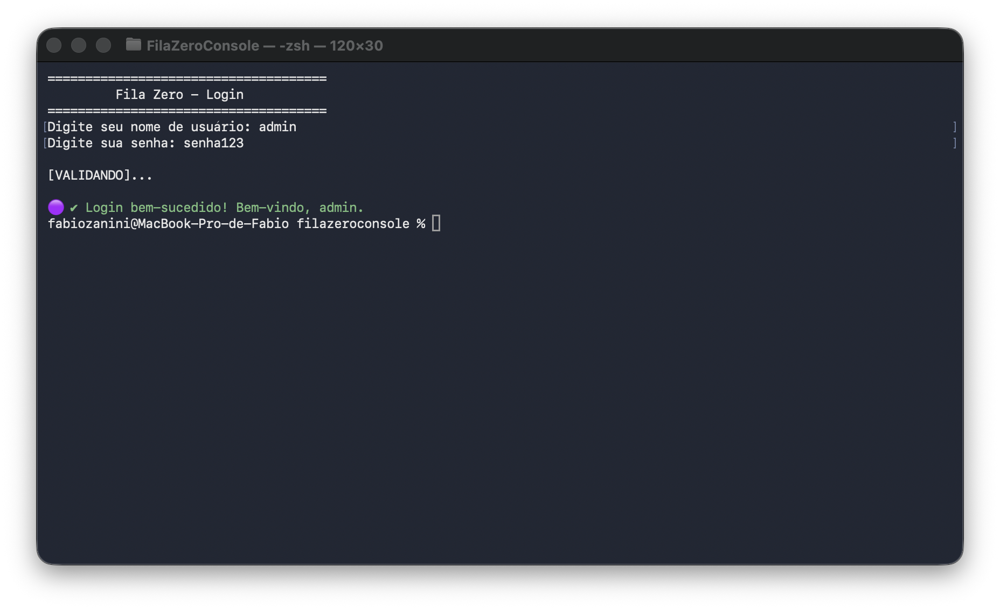

# 🔐 Projeto FilaZero Console

## 👤 Aluno
Fábio Zanini

---

Este projeto é uma aplicação de console em **C# utilizando .NET** que simula um sistema de login com interação via terminal.

O objetivo da atividade foi aplicar conceitos de **Experiência do Usuário (UX)** dentro de um ambiente de linha de comando, utilizando feedback visual e boas práticas de usabilidade.

---

## 🛠️ Comandos Utilizados

- `dotnet new console -n FilaZeroConsole`  
  Cria a estrutura inicial do projeto com o nome "FilaZeroConsole".

- `cd FilaZeroConsole`  
  Acessa a pasta do projeto.

- `code .`  
  Abre a IDE.

- `dotnet run`  
  Executa o programa no terminal.

---

## 📦 Estrutura do Projeto

Arquivos principais:

1. `Program.cs`  
   Contém a lógica do sistema de login.

2. `FilaZeroConsole.csproj`  
   Arquivo de configuração do projeto.

Framework utilizado:

- `.NET 10.0 (net10.0)`

---

## 🧠 Heurísticas de UX Aplicadas

### 1️⃣ Visibilidade do Status do Sistema

O sistema informa ao usuário que o login está sendo processado através da mensagem `[VALIDANDO...]`, evitando a sensação de travamento.

---

### 2️⃣ Prevenção de Erros

As mensagens de erro são exibidas de forma clara e amigável quando o usuário digita credenciais incorretas.

---

### 3️⃣ Estética e Design Minimalista

O sistema utiliza cores no terminal (verde para sucesso e vermelho para erro) e ícones para facilitar a leitura e melhorar a experiência do usuário.

---

## 🔐 Credenciais de Teste

Para acessar o sistema:

- Usuário: `admin`  
- Senha: `senha123`

---

## 📸 Evidência de Execução

Print do sistema funcionando com o comando `dotnet run`.

